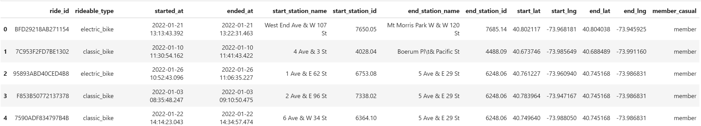
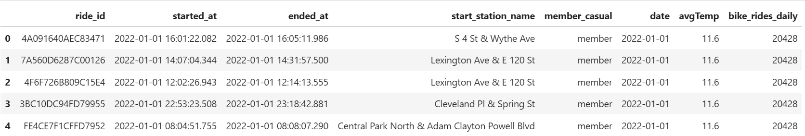
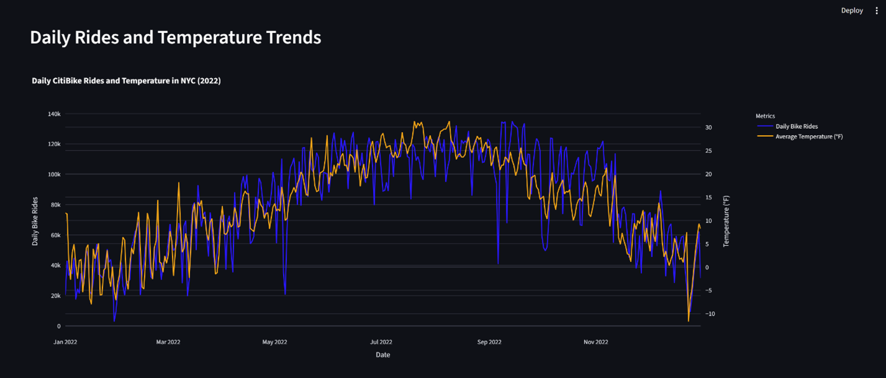
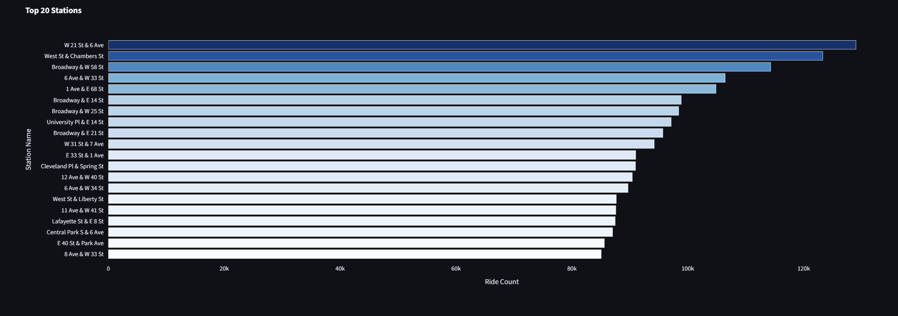
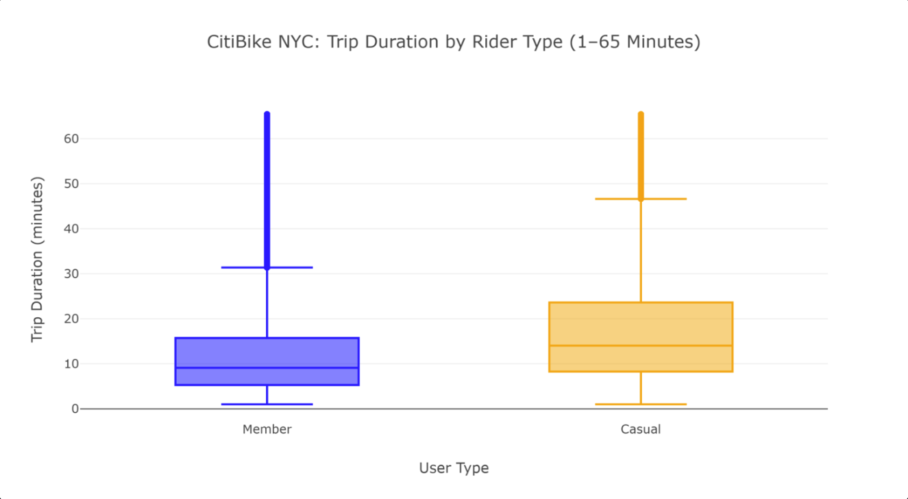
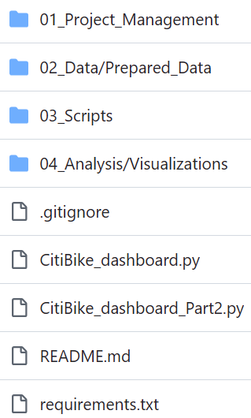

# CitiBike Strategic Dashboard Analysis  
**Project Type:** Descriptive Analysis  
**Role:** Lead Analyst  
**Timeline:** 2 Months  
**Primary Stakeholder:** CareerFoundry – Data Visualizations with Python  
**Tools:** Python (Pandas, NumPy), JupyterLab, Matplotlib, Seaborn, Plotly, Kepler.gl, Streamlit, Git & GitHub  
**Data Sources:** Citi Bike Open Data, NOAA Weather API  

---

## Live Project Links
- <a href="https://citibike-4app9pxamtuuyrqmhstmttp.streamlit.app/" target="_blank">Live Dashboard</a>  
- <a href="https://github.com/Chase-Bjerke/CitiBike" target="_blank">GitHub Repository</a>

---

## Project Overview
CitiBike’s rapid expansion in New York City has created recurring availability issues, with some stations frequently empty and others consistently full. My role was to diagnose the root causes using CitiBike’s 2022 trip data and NOAA weather data, and to present the findings in a multi‑page Streamlit dashboard for the strategy team.

The analysis focused on understanding station demand, seasonal patterns, rider behavior, and geographic hotspots that contribute to system strain.

---

## Project Setup
I began by reviewing the project brief, outlining the workflow, and building a two‑month plan in Trello.  
I then created a GitHub repository, set up SSH authentication, and built a clean folder structure to keep the project organized as the dataset grew.

---

## Business Questions
1. Which stations experience the highest demand throughout the year  
2. How do temperature and seasonal weather patterns influence ridership  
3. Where do trip clusters and geographic hotspots occur  
4. What do the most common routes reveal about system pressure  
5. How do trip durations differ between rider types  

---

## Data Cleaning and Preparation
CitiBike provides multiple years of trip data. I selected 2022, the most recent full year, and merged all twelve monthly CSVs into a single dataset.

Key cleaning steps included:
- Converting date fields to proper datetime objects  
- Converting NOAA temperatures from Celsius to Fahrenheit  
- Standardizing station names and coordinates using a reference table  
- Aggregating trip‑level data into daily metrics  

### Engineered Columns
- **date** – extracted from timestamps for daily grouping  
- **avgTemp** – merged from NOAA weather data  
- **bike_rides_daily** – total rides per day  

These transformations produced a clean, analysis‑ready dataset.

---

## Before / After

### Raw Data Head

### Clean Data Head

---

## Exploratory Data Analysis
I created focused slices of the data—daily ridership, station demand, and rider‑type summaries—to reduce noise and identify which visuals would be most effective.

A major insight emerged when comparing daily ridership with temperature. Viewed separately, both showed similar seasonal shapes. Combined in a dual‑axis chart, the relationship became clear.

### Daily Rides vs Temperature

---

## Visualization Development
I used a tiered approach to build the visuals:
- Matplotlib for quick EDA  
- Seaborn for cleaner styling  
- Plotly for interactive dashboard visuals  

### Key Visuals

#### Top 20 Stations

#### Trip Duration Differences

---

## Geospatial Analysis
To understand spatial demand, I used Kepler.gl to map station‑to‑station routes.  
The full dataset was too large to render, so I created a subset of the top 500 most frequent routes, which still captured major movement patterns.

Filtering these routes revealed:
- Geographic hotspots  
- High‑traffic corridors  
- Areas with recurring availability strain  

### Geospatial Routes  
*(Replace this placeholder once your actual PNG is exported)*

---

## Dashboard Development
This was my first time transitioning from a notebook workflow into a full Python script. I adapted to Streamlit’s multipage structure to keep each analytical theme focused and easy to explore.

### Dashboard Pages
- Most Popular Stations  
- Weather and Daily Rides  
- Trip Duration Patterns  
- Geographic Hotspots  

---

## Deployment
The full dataset exceeded Streamlit Cloud’s limits, so I created reduced subsets containing only the fields needed for each page.

Additional deployment steps included:
- Creating a `requirements.txt` file for consistent package installation  
- Configuring Streamlit Cloud to auto‑update on GitHub pushes  

---

## Key Insights
- Ridership follows a clear seasonal pattern tied to temperature  
- Members and casual riders use the system differently  
- Demand concentrates around specific stations and corridors  
- Route patterns highlight where availability issues are most likely  

---

## Recommendations
- Prioritize bike availability at consistently busy stations during low‑ridership months  
- Expand or reinforce capacity in peak‑season hotspots  
- Tailor incentives to member behavior and seasonal patterns  
- Strengthen availability along the busiest corridors  

---

## Summary
This analysis provides a clear view of how temperature, station demand, and rider behavior shape CitiBike’s operational challenges. The final Streamlit dashboard gives the strategy team an interactive way to explore these patterns and identify where capacity improvements will have the greatest impact.