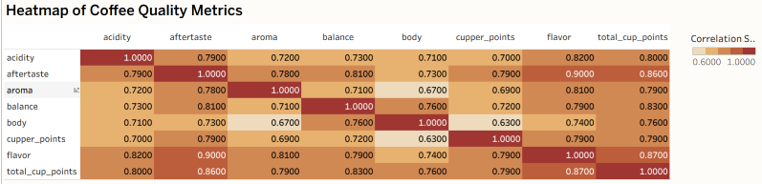
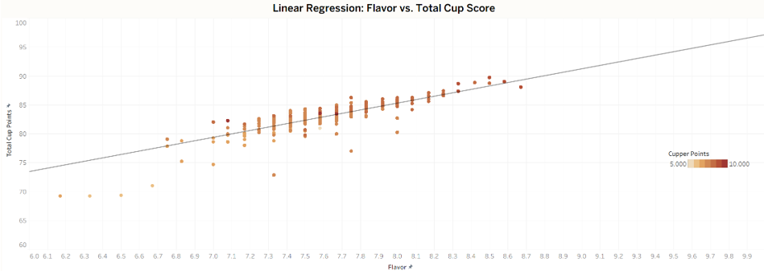
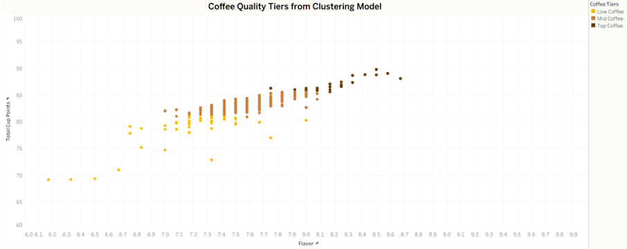
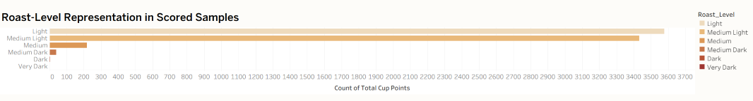

<nav style="margin-bottom: 20px;">
  <a href="/Portfolio/" style="margin-right: 15px;">Home</a>
  <a href="/Portfolio/about_me/" style="margin-right: 15px;">About</a>
  <a href="/Portfolio/projects/" style="margin-right: 15px;">Projects</a>
  <a href="/Portfolio/contact_page/">Contact</a>
</nav>

## Overview
This project analyzes global coffee quality scores from the Coffee Quality Institute to understand how roast level, flavor attributes, and country of origin influence overall cupping performance. Using exploratory analysis, regression, and clustering, the project identifies flavor‑driven quality patterns and defines a three‑tier segmentation system for coffee quality.

---

## Objective
This analysis explores:
- Which countries consistently produce high‑scoring coffees  
- How roast levels influence sensory scores  
- Which flavor attributes predict Total Cup Points  
- How clustering reveals quality tiers and flavor groupings  

---

## Methods
- Data cleaning, normalization, and feature engineering  
- Linear regression to test flavor as a predictor of Total Cup Points  
- KMeans clustering (k = 3) to segment quality tiers  
- Roast‑level distribution analysis  
- Tableau Storyboard for visual storytelling  

---

## Data Sources
- Coffee Quality Database (CQI)  
- Top Rated Coffee dataset  
- Coffee Production by Region (time series)  

---

## Exploratory Analysis
Initial exploration showed strong correlations between flavor, aroma, and Total Cup Points. Regression confirmed flavor as the strongest predictor of overall quality (R² = 0.56), especially in medium roast profiles. Acidity and aftertaste showed weaker relationships, guiding downstream modeling choices.

### Correlation Heatmap  

### Flavor vs Total Score Regression  

---

## Clustering Results
KMeans clustering (k = 3) using flavor and total score revealed three distinct quality tiers:

- **Top Tier** – High flavor, aftertaste, and acidity; scores above ~87.5  
- **Mid Tier** – Balanced profiles with moderate sensory attributes  
- **Low Tier** – Lower aftertaste and acidity; often associated with darker roasts  

These tiers aligned with cupping notes and informed sourcing recommendations.

### Clustering Scatter Plot  

---

## Roast‑Level Patterns
Roast‑level distributions showed that medium roasts consistently achieved the highest flavor and total scores, while darker roasts tended to fall into the lower tier due to bitterness and astringency.

### Roast‑Level Bar Chart  

---

## Key Insights
- Flavor is the strongest predictor of overall coffee quality  
- Medium roasts show the clearest flavor–quality relationship  
- Three quality tiers emerge consistently across origins  
- Low‑tier coffees often show bitterness tied to darker roasts  

---

## Recommendations
- Analyze country‑level tier distribution to guide sourcing strategies  
- Test PCA and expanded clustering to refine tier definitions  
- Finalize Storyboard layout and annotations for stakeholder review  

---

## Limitations
- Clustering used only flavor, aftertaste, and total score  
- Other attributes were excluded from model inputs  
- Sample sizes vary by country and roast level  

---

## Project Links
- **GitHub Repository:** https://github.com/Chase-Bjerke/coffee-quality-analysis  
- **Tableau Storyboard:** https://public.tableau.com/app/profile/chase.bjerke/viz/GlobalCoffeeQualityAnalysis/GlobalCoffeeQuality