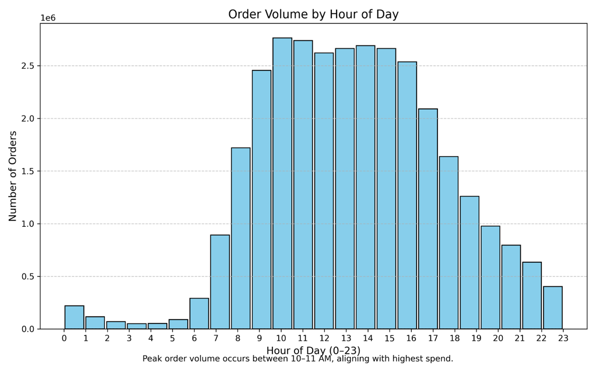
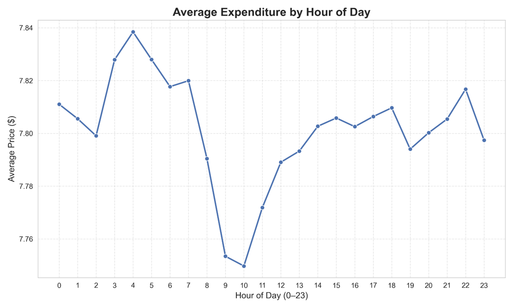
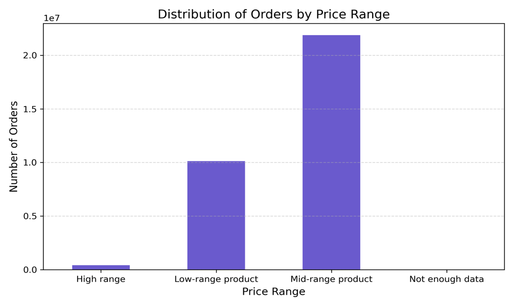
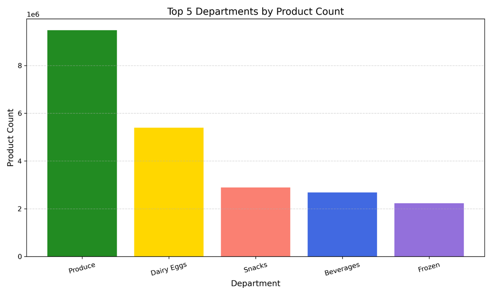
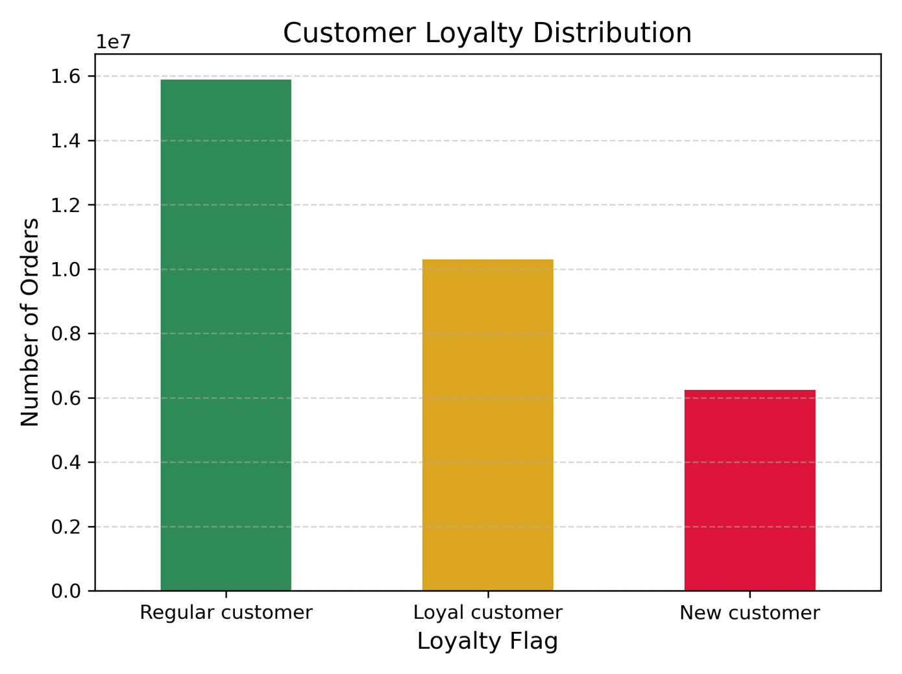
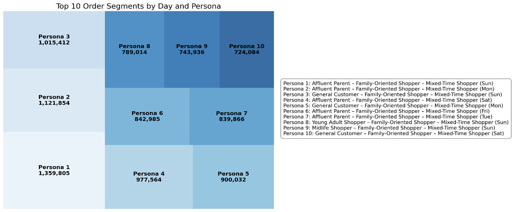

<nav style="margin-bottom: 20px;">
  <a href="/Portfolio/" style="margin-right: 15px;">Home</a>
  <a href="/Portfolio/about_me/" style="margin-right: 15px;">About</a>
  <a href="/Portfolio/projects/" style="margin-right: 15px;">Projects</a>
  <a href="/Portfolio/contact_page/">Contact</a>
</nav>

# Instacart – Grocery Basket Analysis — Summary

## Overview
Instacart is a leading online grocery platform seeking deeper insight into customer purchasing behavior to refine marketing strategy and improve engagement. This analysis explores ordering patterns, spending behavior, product popularity, and customer segmentation to support more targeted and effective campaigns.

---

## Objective
This analysis focuses on:
- When customers place orders and how much they spend  
- Which products and price ranges drive the most engagement  
- How loyalty, demographics, and regional habits shape purchasing behavior  

---

## Methods
- Data cleaning, merging, and feature creation  
- Exploratory analysis by time, product category, and customer profile  
- Visualizations using Python (pandas, numpy, matplotlib, seaborn)  

---

## Data Sources
- CareerFoundry customer dataset  
- Instacart Online Grocery Shopping Dataset 2017  
- Data dictionary and citation provided by Instacart via Kaggle  

---

## Peak Ordering Times and Spend Behavior
Most orders occur between 9 AM and 3 PM, with a mid‑morning peak.  
Spending spikes at 3 AM, suggesting opportunities for premium product targeting during off‑peak hours.

### Orders by Hour of Day  

### Average Expenditure by Hour of Day  

---

## Product Popularity and Price Segmentation
Mid‑range products dominate order volume.  
Top‑performing departments include Produce, Dairy & Eggs, and Snacks.

### Orders by Price Range  

### Top 5 Departments by Product Count  

---

## Customer Segmentation and Loyalty
Regular customers drive the majority of order volume.  
Personas show distinct ordering patterns by day and time, supporting targeted marketing and retention strategies.

### Customer Loyalty Distribution  

### Top Order Segments by Day and Persona  

---

## Key Insights
- Orders peak mid‑morning; spending peaks at 3 AM  
- Mid‑range products ($5–$15) dominate customer baskets  
- Produce, Dairy & Eggs, and Snacks are the highest‑volume departments  
- Loyal customers show predictable ordering patterns that support segmentation  

---

## Recommendations
- Target off‑peak hours with ads and premium product promotions  
- Focus high‑margin product ads between 10 AM–3 PM  
- Promote mid‑range products and top departments to maximize engagement  
- Tailor campaigns by persona and reward loyal customers with personalized offers  

---

## Project Links
- **GitHub Repository:** https://github.com/Chase-Bjerke/instacart-basket-analysis-python