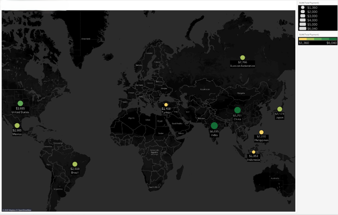
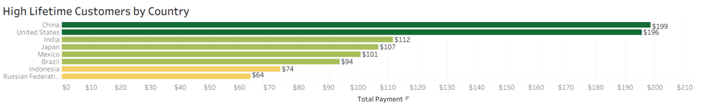

<nav style="margin-bottom: 20px;">
  <a href="/Portfolio/" style="margin-right: 15px;">Home</a>
  <a href="/Portfolio/about_me/" style="margin-right: 15px;">About</a>
  <a href="/Portfolio/projects/" style="margin-right: 15px;">Projects</a>
  <a href="/Portfolio/contact_page/">Contact</a>
</nav>

## Overview
Rockbuster Stealth LLC is a global movie rental company transitioning from physical stores to an online streaming platform. This analysis supports their digital rollout by uncovering insights from internal data related to revenue, customer distribution, and rental behavior.

---

## Objective
This project focuses on:
- Delivering data-driven insights to support Rockbuster’s digital service launch  
- Analyzing revenue, customer location, and rental patterns  
- Identifying high-value markets and customer segments to guide strategic decisions  

---

## Methods
- SQL for querying, filtering, cleaning, and summarizing datasets  
- Complex joins, subqueries, and CTEs to structure analysis  
- Tableau dashboard for visual storytelling and stakeholder communication  

---

## Data Sources
Rockbuster internal datasets:
- Film inventory  
- Customer information  
- Payment transactions  
- Country and regional data  

---

## Rental Insights
Key descriptive metrics:
- Average Rental Duration: 4.99 days  
- Average Rental Rate: $4.99  
- Average Movie Length: 115.27 minutes  
- Average Replacement Cost: $19.98  

These metrics inform pricing strategy, inventory planning, and customer engagement.

### Rental Metrics  

---

## Global Revenue Distribution
Revenue varies significantly by region, with clear geographic concentration.

Top revenue markets:
1. India  
2. China  
3. United States  

These regions represent the strongest launch targets for Rockbuster’s digital platform.

### Top Revenue Markets  

---

## High Lifetime Value Customers
China, the U.S., and India also lead in total payments from high-lifetime-value customers.  
This overlap reinforces their importance for digital expansion and long-term profitability.

### Lifetime Value by Country  

---

## Key Insights
- India, China, and the U.S. consistently lead in revenue and high-value customers  
- Rental patterns support opportunities for localized pricing  
- High-value customers are concentrated in top revenue markets  
- Foundational rental metrics provide a baseline for future segmentation  

---

## Recommendations
- Prioritize digital launch in Asia and North America  
- Target retention and engagement strategies in top revenue regions  
- Develop localized pricing, promotions, and subscription models  
- Use customer lifetime value to guide targeted marketing  

---

## Project Links
- **GitHub Repository:** https://github.com/Chase-Bjerke/rockbuster-stealth-sql-analysis  
- **Tableau Visualizations:** https://public.tableau.com/app/profile/chase.bjerke/viz/RockbusterStealthDataAnalysisVisualizations/CustomerCountTop10Countries